# benchmarks

Extra datasets not in repo available at https://ftp.pdl.cmu.edu/pub/datasets/twemcacheWorkload/cacheDatasets

```shell
cd throughput
./bench.sh

cd simulator
./bench.sh

cd memory
./bench.sh
```

## Throughput

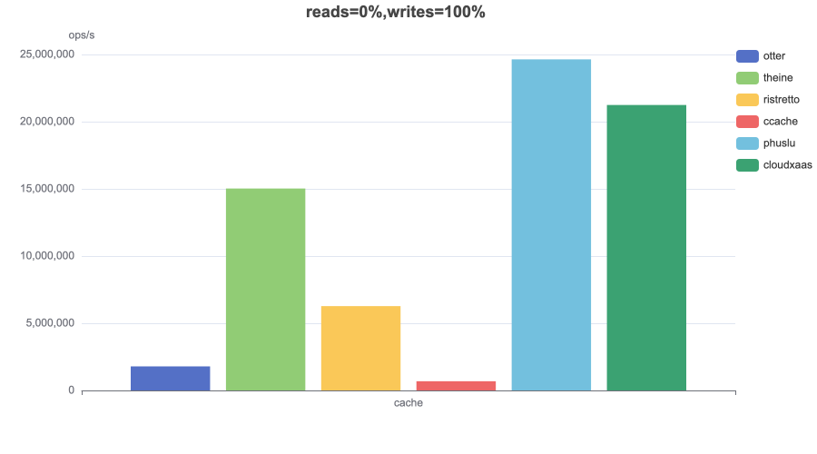
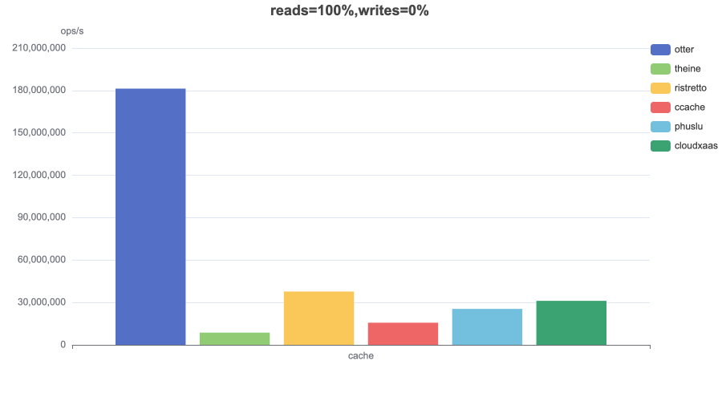
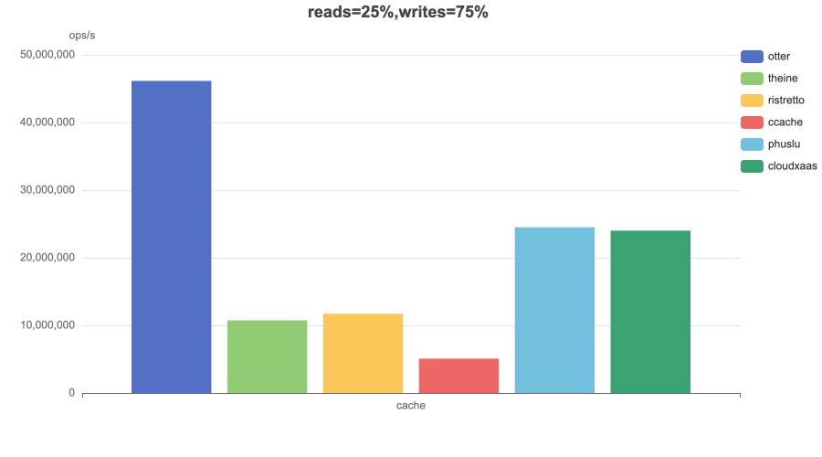
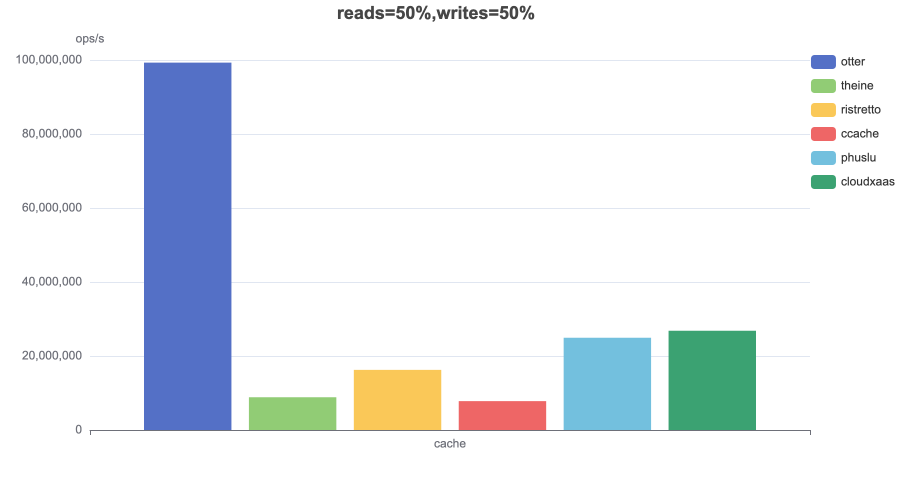
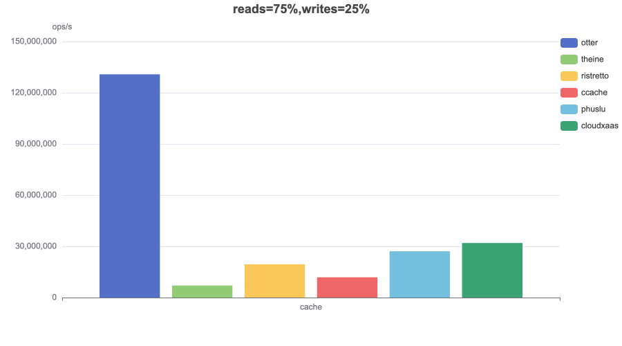

## Hit Ratio

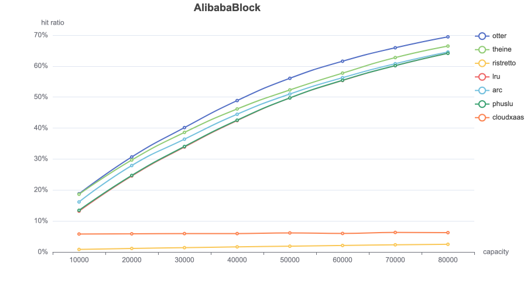
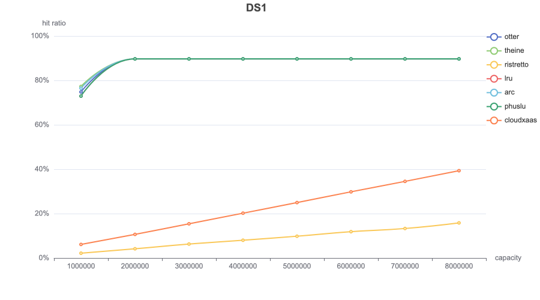
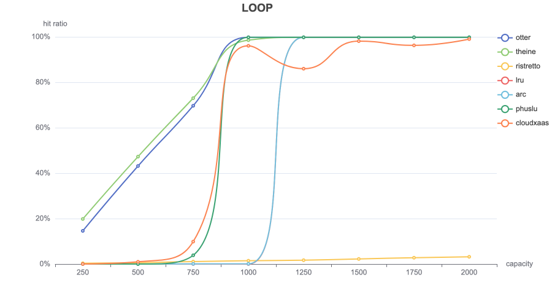
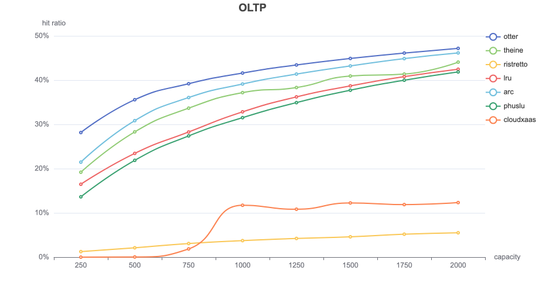
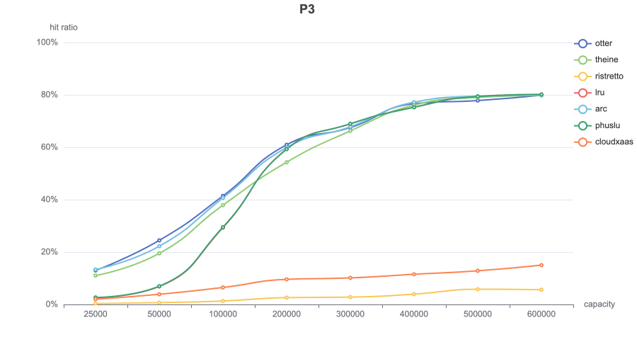
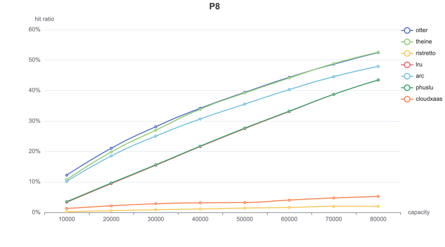
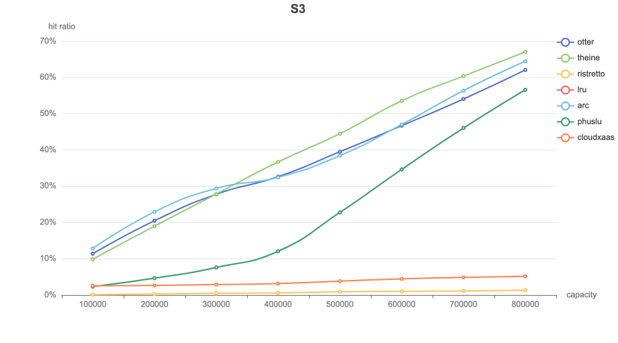
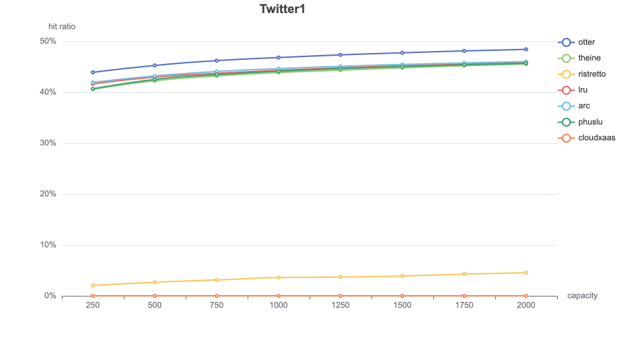
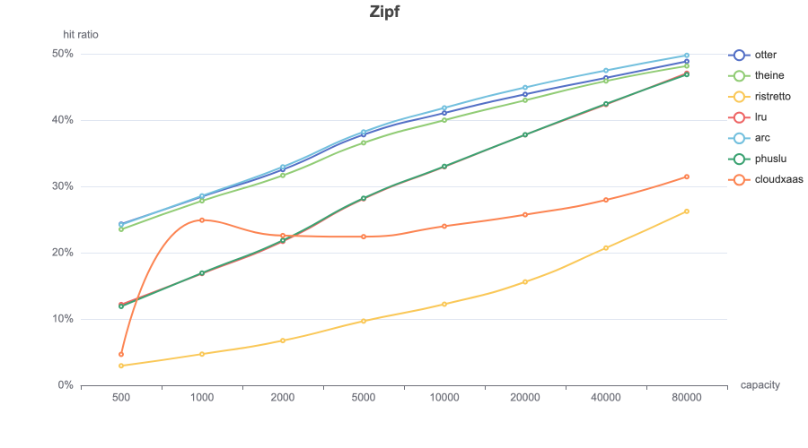

## Memory Usage

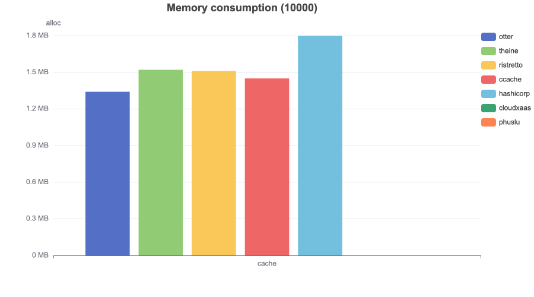
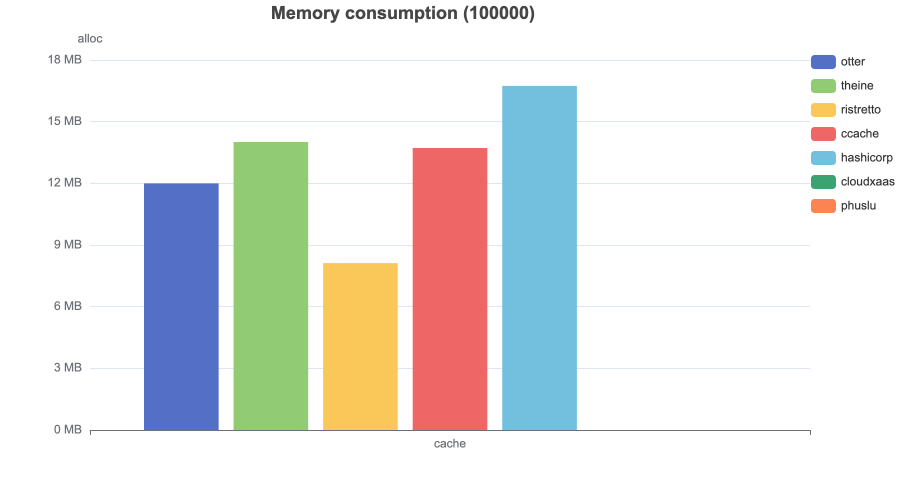
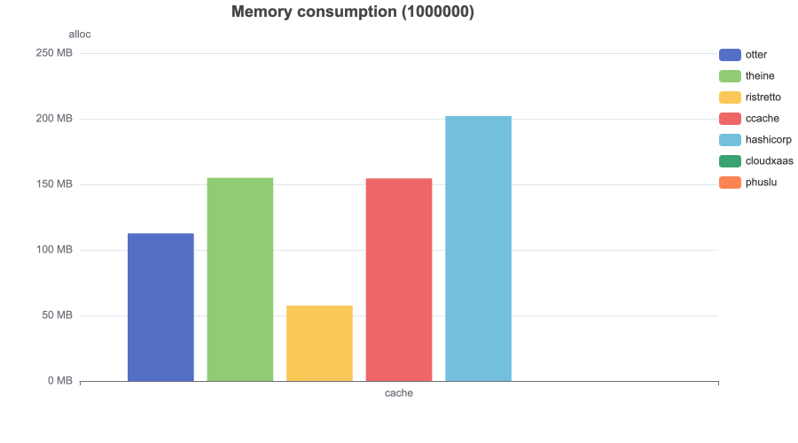
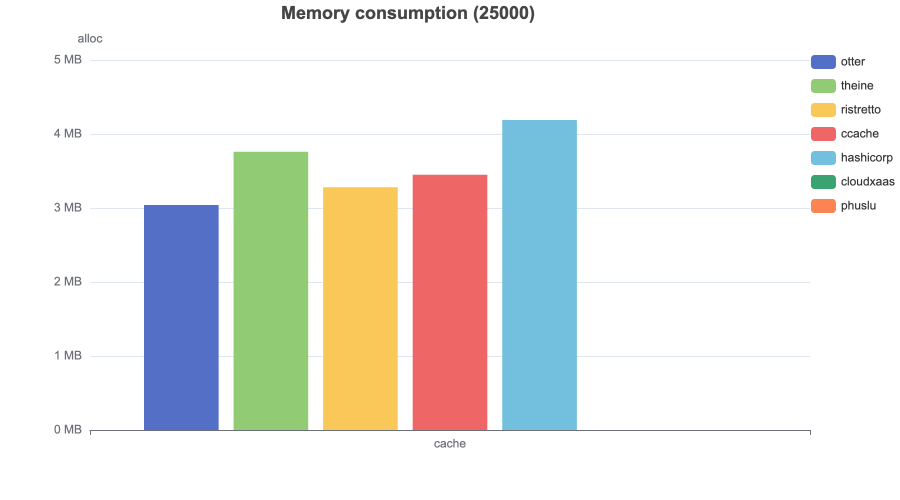
